# UltraKIL Manager Portal — Manager Guide

This guide covers the day-to-day tasks a manager needs for the Phase 1
pilot: setting up customers, agreements and visits, understanding the
conflicts the system flags, overriding them by hand when needed, and
publishing a schedule. It assumes you can already sign in — if not, ask
your administrator for an account.

Screenshots in this guide are from a local test environment with sample
data, not the live UltraKIL fleet and not the deployed staging build —
they are representative local examples of each screen, not a guarantee
of pixel-for-pixel parity with staging. Deployed-staging screenshots and
a pass against real customer/technician data are still pending (see
`known-limitations.md`) and will replace these once available.

**What this covers today:** the manager portal (this web app), used from a
desktop or laptop browser. There is no phone app yet — technicians and PMS
supervisors don't have a mobile view. That's planned for Phase 2, described
at the end of this guide under "What's coming later."

---

## 1. Adding a customer and their sites

Go to **Customers → Add customer**. A customer needs at least one site
before you can create a service agreement for it.

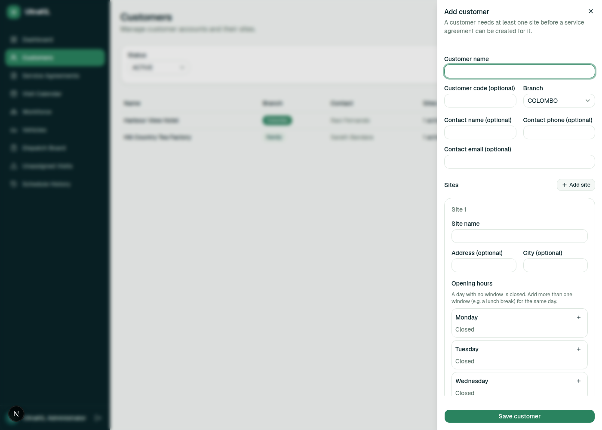

For each site you can set:

- **Address / city** (optional, for reference)
- **Opening hours per weekday** — each day is independent. Leave a day with
  no time window and it's treated as closed. You can add more than one
  window on the same day (for example, a lunch closure) using the **+**
  button next to that day.

A customer and its sites belong to one branch (Colombo or Kandy) — this
determines which employees and vehicles can ever be assigned to work
there, so double-check it before saving.

---

## 2. Creating a service agreement

Go to **Service Agreements → Add agreement**. This is where you say what
recurring work a site needs.

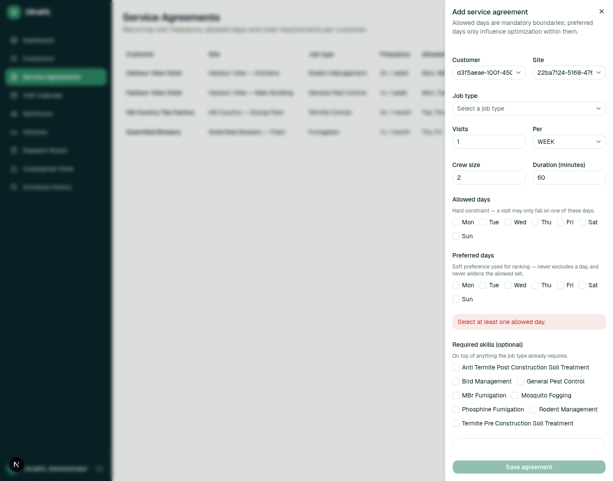

> **Known display defect in this screenshot:** the Customer and Site
> fields above are showing raw internal IDs (`d3f5aeae-…`, `22ba7124-…`)
> instead of the customer/site name. The dropdown's own option list is
> unaffected — it correctly lists names — so this is specifically the
> closed selector failing to resolve the chosen id back to its label.
> Triaged in `known-limitations.md`; not a data-exposure issue (these are
> internal identifiers, not customer PII), but the screenshot needs
> retaking once fixed.

Key fields:

- **Visits / Per** — how often the work repeats (e.g. "2 / WEEK" or
  "1 / MONTH"). Frequency is flexible per agreement; there's no fixed
  company-wide schedule.
- **Crew size** — how many people must be on site. This varies by
  agreement — a small routine visit might need 2, a larger job 3 or more.
- **Allowed days** — a **hard constraint**. A visit can never be scheduled
  outside these weekdays, no matter what.
- **Preferred days** — a **soft preference**, used only to rank options
  within the allowed days. It can never widen the allowed set, and the form
  won't let you mark a day preferred until it's already allowed.
- **Required skills** — anything extra the job needs beyond what the job
  type itself already implies (e.g. a fumigation job might specifically
  need MBr Fumigation).

Once saved, an agreement can be **paused** from the Service Agreements list
without deleting it — useful if a customer temporarily suspends service.

---

## 3. Generating visits

Service agreements describe recurring *demand*; they don't create anything
on the calendar by themselves. Go to **Visit Calendar → Generate visits**.

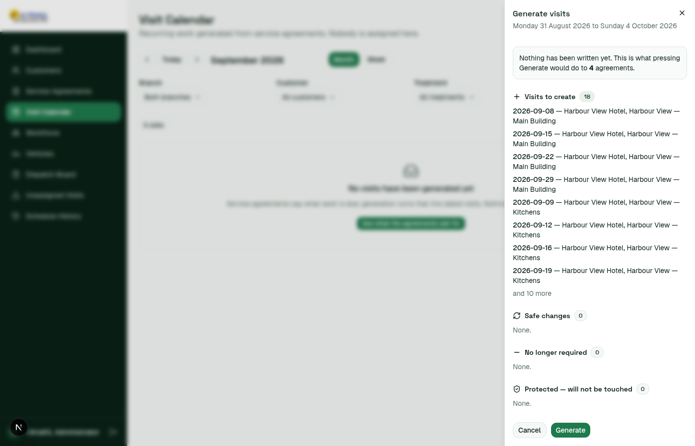

This is always a **preview first** — nothing is written until you click
**Generate** in the panel. It shows exactly what will be created, what's
a safe change to an existing visit, what's no longer required (because an
agreement changed or was paused), and what's protected and won't be
touched (see "Locks," section 6).

---

## 4. Reading the Dispatch Board and assigning a crew

**Dispatch Board** shows, for a given date and branch, every visit and who
(if anyone) is on it. A visit with no crew shows a plain-language reason
why, e.g. "No PMS supervisor." Click **Edit crew** to open the assignment
editor.

In the editor:

- **Add crew member** — the employee list only shows people who are
  actually eligible for this site's branch. An employee permanently
  stationed at a different site can still be selected here, but adding
  them produces a validation error explaining why (see section 5).
- **Add vehicle** — only vehicles belonging to the visit's branch are
  offered. Once a vehicle is chosen, the **Driver** dropdown next to it
  only offers people who are *both* already on this crew *and* individually
  checked as authorized to drive that specific vehicle — never anyone else,
  even if they're authorized for a different vehicle.
- **Reason for this change** — fill this in before saving a manual
  edit. **The Save button stays disabled until you do, even once every
  validation check has passed** — if Save looks greyed out with no visible
  error, this is usually why.

Once every check passes, the panel says *"This crew is eligible to take
the visit"* and Save becomes available.

---

## 5. Vehicles with more than one driver

A company vehicle is not owned by one person. Open **Vehicles** and click
any vehicle to see its full list of authorized drivers — every one is
shown as an equal row reading only "Authorized to drive," with no
"primary driver" or ownership concept anywhere on the page.

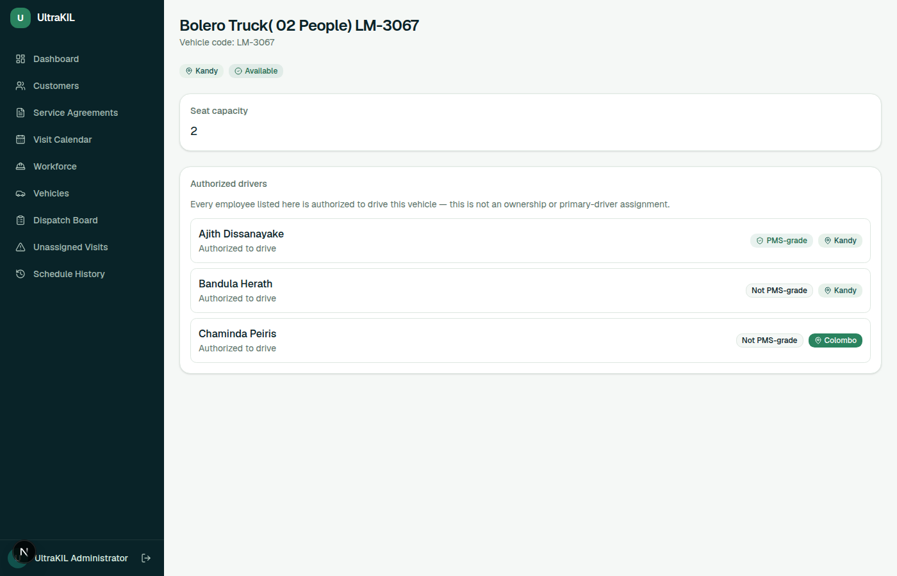

This carries through to assignment:

- In the **Edit crew** drawer, the **Driver** dropdown for a vehicle only
  offers people who are *both* on that visit's crew *and* individually
  checked as authorized for that specific vehicle. Someone not checked for
  it never appears in the list at all — there's nothing to reject after
  the fact, because the list is filtered before you open it.

  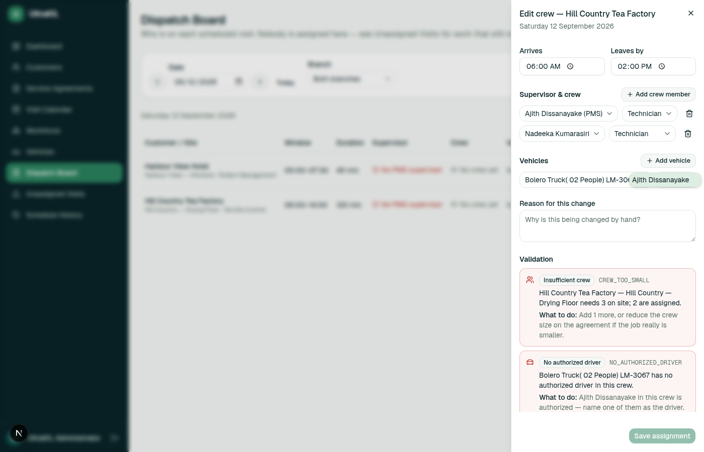

- The same vehicle can be assigned to two different visits with two
  different authorized drivers — nothing about assigning it once reserves
  it to one person.
- If you remove the assigned driver from the crew (not the vehicle), the
  vehicle's **Driver** field clears back to its placeholder and the
  Validation panel immediately re-checks, naming any other crew member who
  is still authorized for that vehicle:

  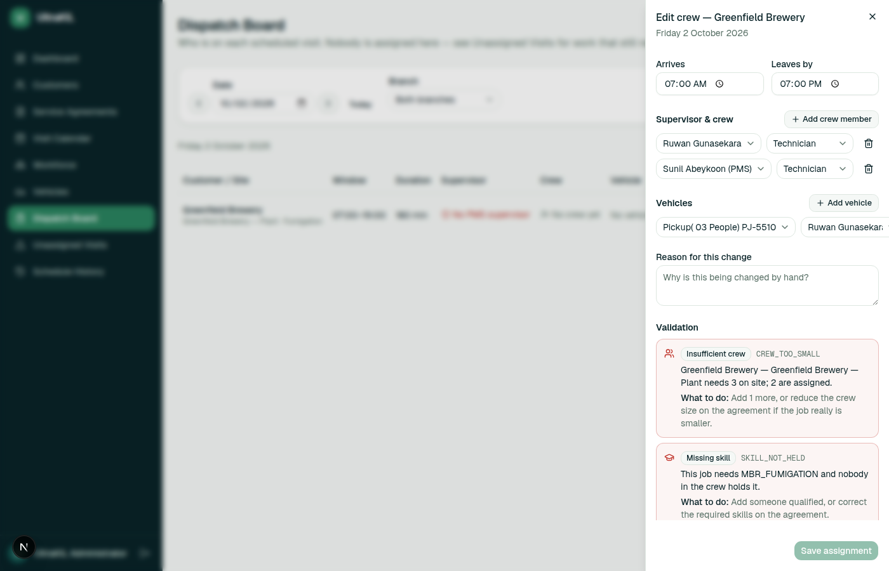
  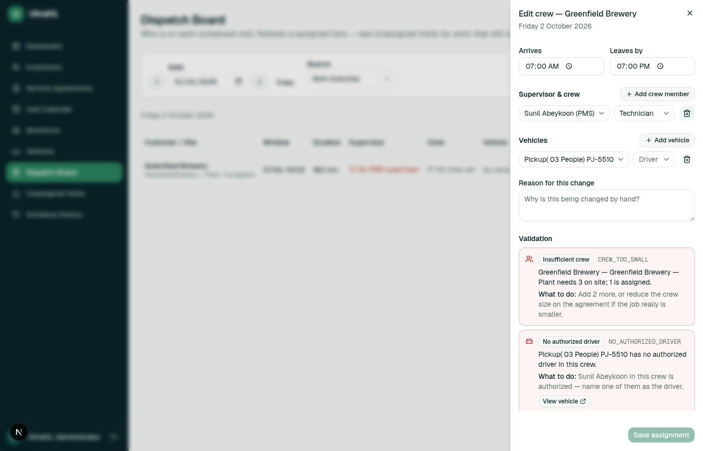

---

## 6. Understanding validation errors

Every rule the system enforces shows up the same way: a labelled card, a
stable error code (useful if you ever need to report an issue), a
plain-English explanation, and a **What to do** line telling you the fix.
You never have to guess.

| What you'll see | What it means | What to do |
| --- | --- | --- |
| **Insufficient crew** `CREW_TOO_SMALL` | Fewer people assigned than the agreement requires. | Add more crew, or fix the crew size on the agreement if it's genuinely wrong. |
| **Missing PMS supervisor** `NO_PMS_SUPERVISOR_AVAILABLE` | Nobody in the crew holds a PMS grade (Senior PMS, PMS, Assistant PMS, SPMS or APMS). | Add a PMS-grade employee from the same branch. |
| **Permanent-staff restriction** `EMPLOYEE_PERMANENTLY_STATIONED` | You've added someone who is permanently stationed at a different site. | Assign a mobile crew member instead. |
| **Missing skill** `SKILL_NOT_HELD` | The job needs a specific skill nobody in the crew holds. | Add someone qualified, or fix the required skills on the agreement. |
| **No authorized driver** `NO_AUTHORIZED_DRIVER` | A vehicle is assigned but nobody in the crew is checked to drive it. | Name one of the checked drivers already in the crew, or add one who is checked. |
| **Unavailable vehicle** `VEHICLE_CAPACITY_EXCEEDED` | The vehicle's seat count is smaller than the whole on-site crew. | Use a larger vehicle. **Note:** adding a second, smaller vehicle does not currently split the crew across both — each assigned vehicle is checked against the *full* crew, not a share of it. |
| **Employee / Vehicle overlap** `EMPLOYEE_DOUBLE_BOOKED` / `VEHICLE_DOUBLE_BOOKED` | This person or vehicle is already committed elsewhere at an overlapping time. | Assign someone/something else, or move one of the two visits. |

None of these are colour-only — every one carries text, so they read
correctly even in black-and-white or for a colour-blind reader.

---

## 7. Overrides and locks

Any manual edit through **Edit crew** is an override — it's how you swap
a sick technician, change a vehicle, or fix a visit the scheduler couldn't
resolve on its own. Every override requires a **Reason**, which is kept in
the visit's history.

If you don't want your manual override undone the next time the scheduler
runs, use **Pin parts of this assignment** at the bottom of the editor:

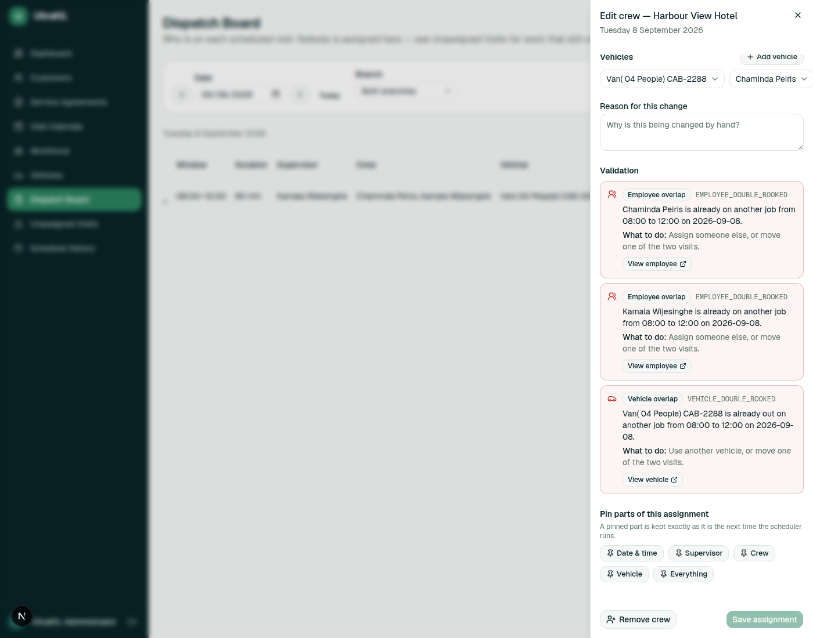

You can pin just the date & time, just the supervisor, just the crew, just
the vehicle, or everything about the assignment. A pinned part is kept
exactly as-is on the next run — the scheduler works around it instead of
overwriting it.

---

## 8. Publishing a schedule

Go to **Schedule History**. This is where the automated optimizer runs —
give it a date range and a branch, click **Start run**, and it proposes a
schedule.

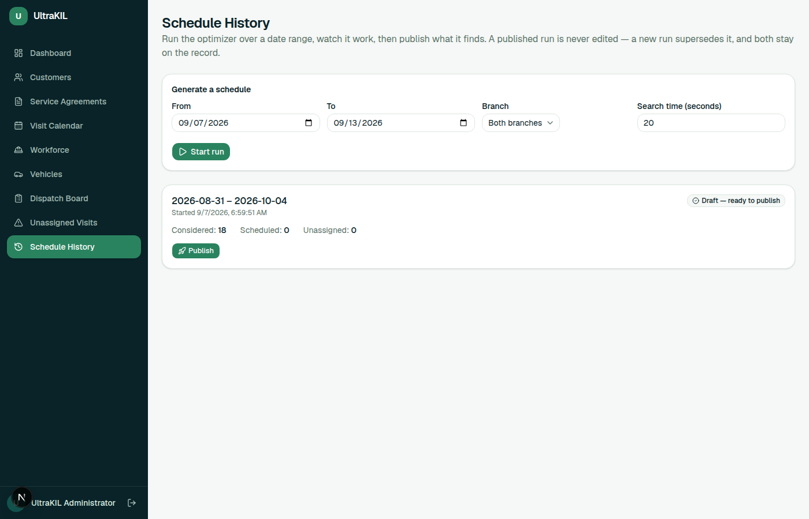

A run stays a **draft** until you review it and click **Publish**.
Publishing is one-way: a published run is never edited in place — running
again and publishing a new one supersedes it, and both stay on the record
for history. This is also where you'd generate a schedule covering a
period, rather than assigning visit-by-visit from the Dispatch Board.

---

## 9. Customers and sites that are no longer active

An inactive customer or site is labelled in **text** (not colour alone) —
e.g. "1 active, 1 inactive" on the Customers list, or an "Inactive" badge
when filtering to inactive customers.

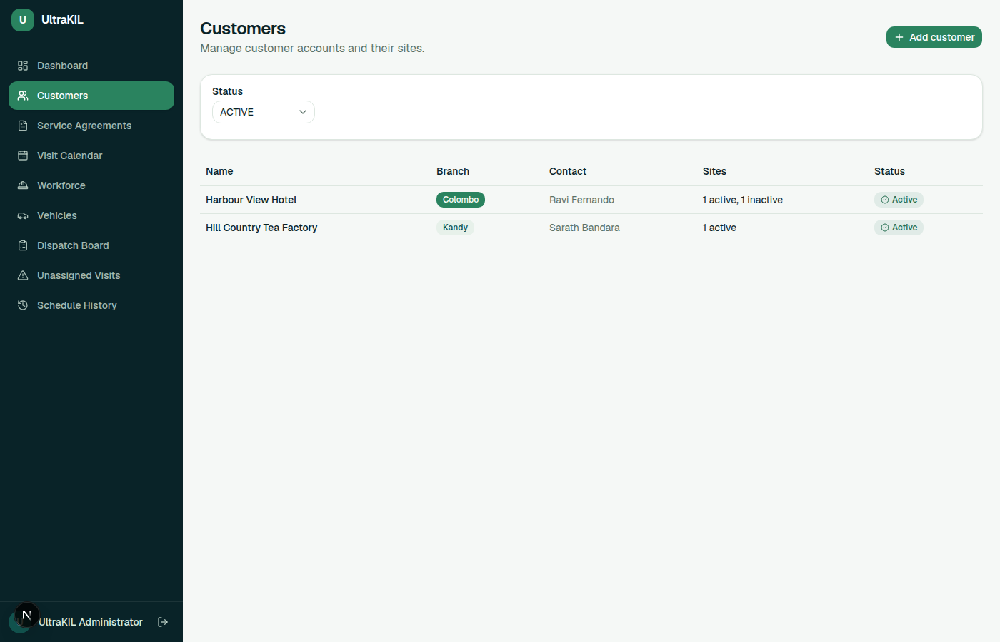
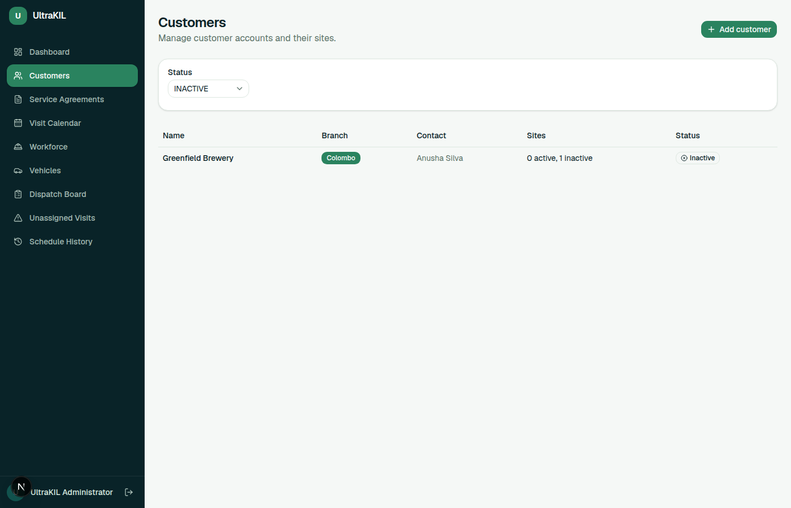

Deactivating a customer or site:

- Removes it from every picker used to create new work — the "Add
  agreement" customer/site dropdowns, for example — so nobody can
  accidentally schedule new work there. A still-active customer with one
  inactive site keeps offering its other active sites; only the inactive
  one drops out of the site picker.

  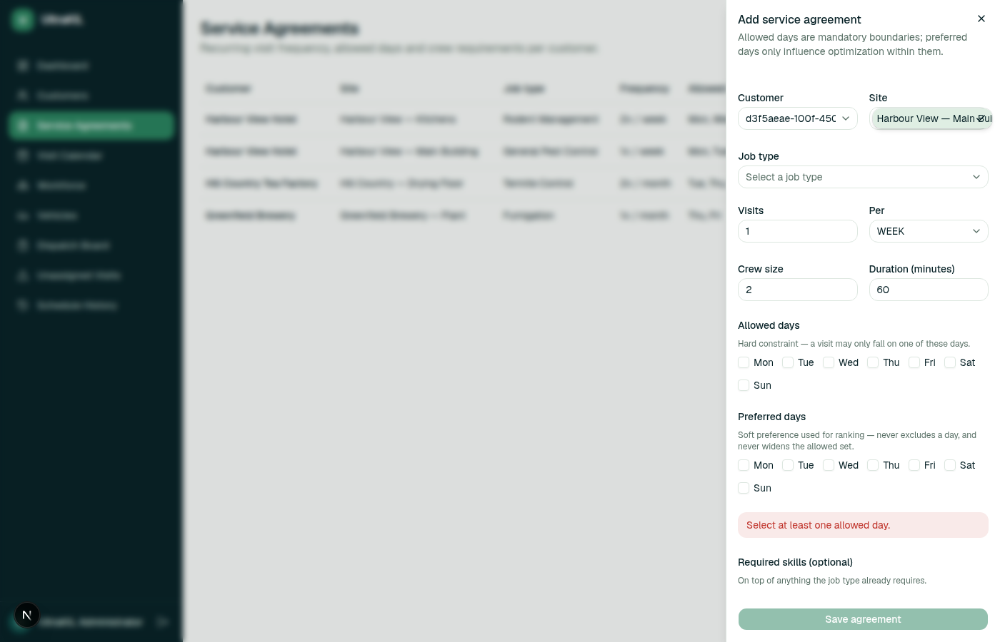

- Stops it from generating any new visits.
- **Does not** hide anything that already happened — a visit that was
  generated before the site went inactive stays visible and editable on the
  Dispatch Board and in history. Going inactive only affects future
  scheduling.

  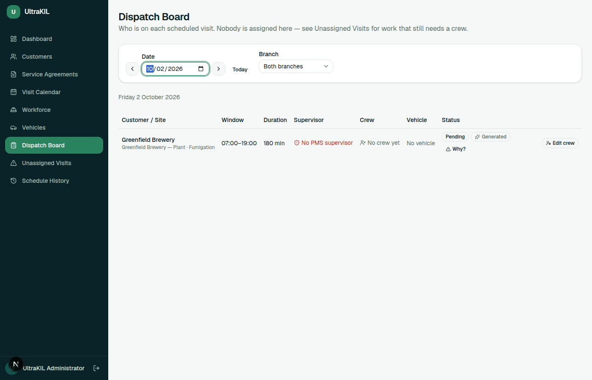

**Note:** in this phase, deactivating a customer/site is not something you
do from this portal directly — it's set by the underlying data import. If
you need one deactivated, contact the person who manages the data import.

---

## 10. Common problems and how to recover

**"I can't find an employee/vehicle in the picker."**
Check the branch on the visit and on the employee/vehicle — the portal only
offers matches within the same branch; this filtering is not lifted for
anyone. Permanently stationed staff are a narrower exception *within* that
same-branch rule: they still only appear on visits for their own branch,
but within that branch they're selectable for any of that branch's sites,
not filtered down to their permanent one first — and get rejected by
validation if you pick a site other than the one they're stationed at.

**"Save stays greyed out and I don't see an error."**
Check the **Reason for this change** field — it's required, and an empty
one silently disables Save with no separate warning.

**"The site I need isn't in the picker at all."**
It's most likely inactive. Check the Customers list with the Status filter
set to "Inactive."

---

## What's coming later (Phase 2)

The following are **out of scope for this Phase 1 pilot** and are not in
this portal:

- A tablet view for PMS supervisors in the field.
- A mobile app for technicians/workers.
- Push notifications.

The underlying data model already keeps these compatible for later, but
there is nothing to click on for them today — if a screen doesn't exist for
one of these, that's expected, not a bug.
